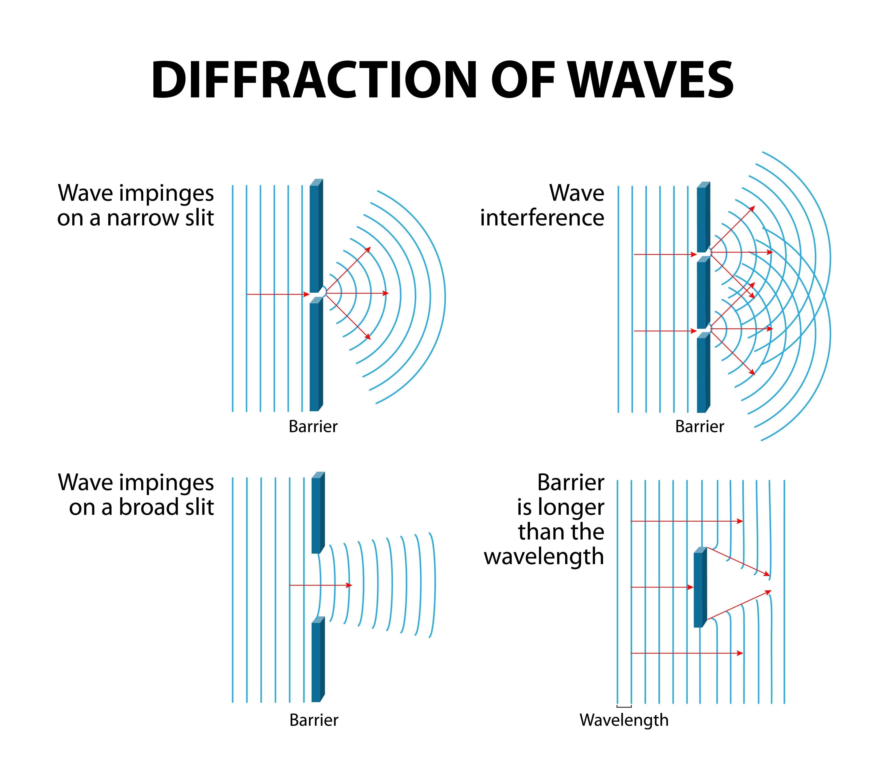

# 🌊 Resonance-Bottleneck-LLM (D2-V13)

**Resonance Bottleneck (共振瓶頸)** 是一個實驗性的輕量級大語言模型架構，核心在於探索如何透過極低維度的「資訊瓶頸」來激發模型內在的推理與特徵對齊能力。

本專案是 `D2-Subset-LLM` 系列的進化版（V13），結合了物理學中的**波干涉 (Wave-Interference)** 概念與 **TinyLoRA** 的極簡參數理念。

---

## 🧠 核心理念：共振瓶頸 (Resonance Bottleneck)

傳統模型在處理路由（Routing）或門控（Gating）時，往往使用龐大的參數矩陣，這容易導致模型死記硬背訓練資料中的雜訊。

**Resonance Bottleneck** 採用了「A+B 混血策略」：
1. **主特徵道 (Full-Rank Path)：** `QKV` 投影維持全維度（768），確保模型有足夠的容量記憶語言知識與程式碼邏輯。
2. **共振控制中心 (Bottleneck Control)：** 將負責波干涉的 `Semantic` 與 `Context` 銀行壓縮至極窄的通道（$768 \to 64$），並透過 `SiLU` 激活函數進行非線性過濾，最後再放大還原。

> **物理比喻：** 就像寬廣的海浪（特徵）被迫擠過一個微小的狹縫（瓶頸），只有最具代表性、最強大的語義頻率能產生「共振」並穿透過去，最終透過干涉效應（Interference）精準地操控模型的大腦開關。





---

## ✨ 架構特色

* **O(N) 線性複雜度：** 採用 **Causal Linear Attention**，記憶體需求隨序列長度線性增長，而非平方增長。
* **隱式專家系統 (Implicit MoE)：** 無須顯式的 Router，透過波的相位差（Phase Difference）自然湧現專家分工。
* **BPE Tokenizer：** 使用自定義的 16K BPE 詞表，大幅提升文本壓縮率與語義理解深度。
* **RTX 3060 優化：** 針對 12GB VRAM 進行極致優化，支援 BF16 混合精度訓練。

---

## 📐 數學核心 (Mathematical Core)

共振干涉公式定義如下：

$$\text{Interference} = A_{sem} \cdot A_{ctx} \cdot \cos(\theta_{sem} - \theta_{ctx})$$

其中 $A$ 與 $\theta$ 是由 **Resonance Bottleneck** 層產生的振幅與相位：
* $x_{compressed} = \text{SiLU}(W_{down} \cdot x)$
* $[A, \theta] = W_{up} \cdot x_{compressed}$

---

## 📈 訓練日誌 (Training Progress)

在初步的實驗中，我們觀察到了顯著的「頓悟（Grokking）」現象：

| Step | Loss | Gate Active | Learning Rate | 狀態描述 |
| :--- | :--- | :--- | :--- | :--- |
| 41 | 207.06 | 0.605 | 4.10e-06 | 隨機混沌期，瓶頸層適應中 |
| 215 | **35.22** | **0.429** | 2.15e-05 | **快速開竅期**，模型開始主動抑制雜訊 |

* **模型規模：** ~189.8M Parameters
* **訓練設備：** NVIDIA GeForce RTX 3060 12GB
* **數據集：** Wikipedia (Multi-lang) + Classical Chinese + Python Code

---

## 🛠️ 快速開始

1. **環境準備：**
   ```bash
   pip install torch tokenizers tqdm
   ```
2. **運行訓練：**
   ```bash
   python d2-v13-resonance.py
   ```

---

## 📜 授權協議 (License)

本專案採用 **MIT License** 授權。核心波函數機制靈感源自 [qllm2](https://github.com/gowrav-vishwakarma/qllm2) 並由本人進行架構重組與優化。

---
